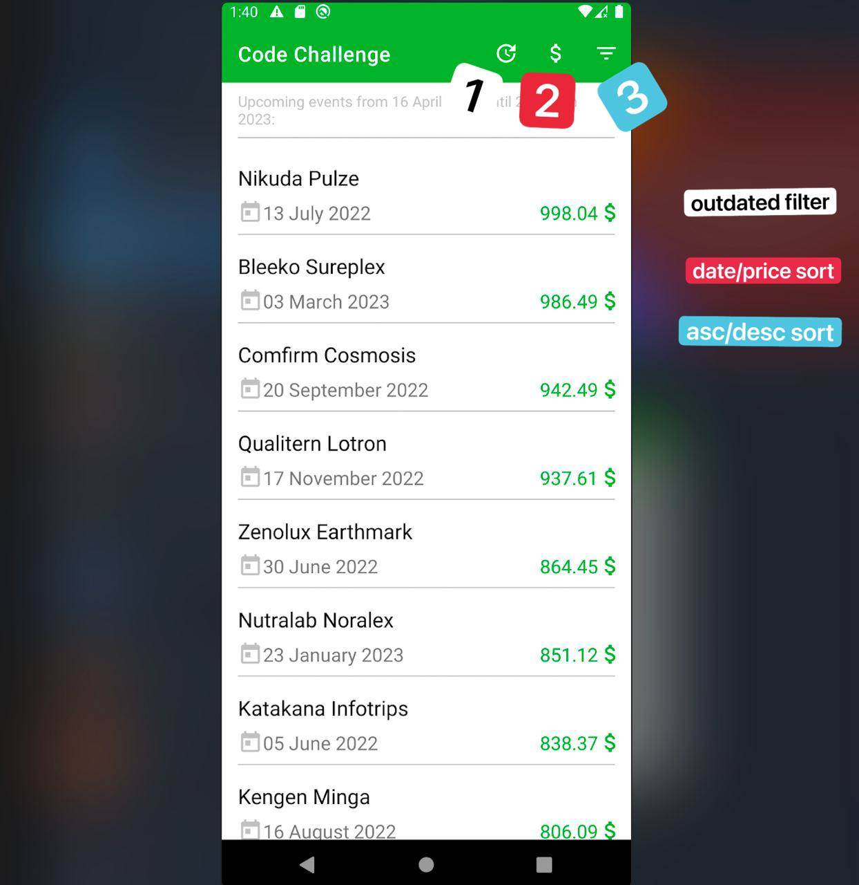
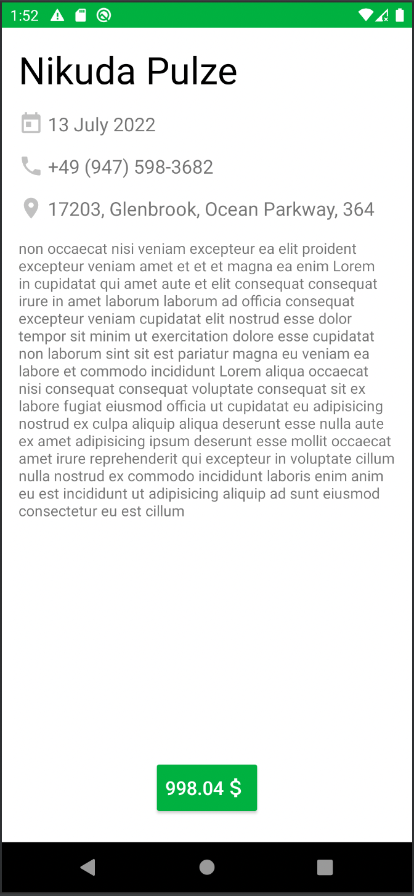

# Android code challenge

  
  

## Use Cases / Requirements
- As a user I want to see a list of upcoming events sorted by date (ascending)
- As a user I want to be able to sort events by price (both descending/ascending)
- As a user I want to see details of a concrete event
- As a user I want to filter out outdated events
- The goal of UnitTest coverage is 80+%

## Design
- Events overview screen should:
    - include a list of events with title and date
    - should contain pull-down to refresh gesture to reload the data
    - buttons for sorting by date/price
    - button to filter out outdated events (optional)
- Event details screen should:
    - should contain: title, event description, date of event, address, contact phone, buy button with price on it

## API dependencies
Documentation for API's could be found in Postman collection under the folder 'docs/EventsList.postman_collection.json'.

# Implementation:
You can find .apk file in the root folder

The structure of the project:
-base
-domain
-data
-presentation

## Base
Here is the package that includes .App class and utils package with util classes as well
Also there is init of DI of whole project
For DI I've selected Koin
So, all dependencies are providing by constructor (where it's possible) with separation between interface contracts
and implementations

## Data
Includes 
- network layer, implemented by using Retrofit
- ApiGateway to handle send actual requests using remote network
- Events repository to get the data, map it and send to domain layer

## Domain
Includes EventsInteractor with small example of business logic of extracting time range and also 
Mapper to map the model from Data Layer to model of Presentation Layer ( EventsDto -> EventsVO )
In modern applications if we want to do architecture properly we need to have different data models
for UI layer and Data layer as well. It helps to test different layers, provides more flexible
architecture as well

## Presentation
Implementation of MVVM with with Fragment as a View and ViewModel as an entry point to getting the data from Interactor
MVVM basically helps to separate the logic and use Fragment class just for a rendering.
Events ViewModel also handles Filter Options state.
Also I created a sealed classes to handle to different states of screens.
For the navigation I used NavController with safe argument passing (navigation-safe-args)

## Note/Disclaimer
I implemented async network requests by using Kotlin Coroutines. 
In ViewModel I'm using viewModelScope.launch {} and handling the errors manually.
It was done due original test task restrictions (it was forbidden to use RxJava2) but I'm more RxJava-guy.
Using it a lot past 3 years, I'm familiar with Coroutines in general but I'd like to mention that I feel 
more comfortable with Reactive Java approach. 
I see that handling errors in Coroutines directly in ViewModel it's not the best case scenario, it's 
definitely area of possible improvement
